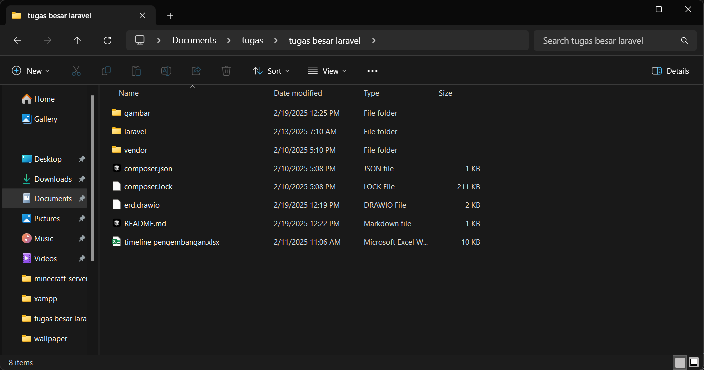

# **Web App Lelang Online**
## **link github**  
https://github.com/ujangPNG/tugas-besar-laravel/tree/progress  
## **link laporan**  
(comment allowed)
https://docs.google.com/document/d/1aLKvt86dR3p5bM2XWRmHSLlpqwGogH1KxHwkr3pRJCk/edit?usp=sharing  
  
  tutorial  
  1. install <a href="https://nodejs.org/dist/v22.14.0/node-v22.14.0-x64.msi">nodejs</a>  
  2. install <a href="https://sourceforge.net/projects/xampp/files/XAMPP%20Windows/8.0.30/xampp-windows-x64-8.0.30-0-VS16-installer.exe">xampp</a>  
  3. install  <a href="https://github.com/ujangPNG/tugas-besar-laravel/archive/refs/heads/progress.zip/">project ini</a>  
  4. extrak project ini di mana aja terserah, kemudian buka folder project ini. di bawah ini terkhusus buat yang ga ngerti cara pake terminal  
  
  5. buka cmd 3x di direktory project ini  
  6. di semua cmd, ketik ```cd ./laravel```  
  7. 

  ```npm run dev``` untuk memasak javascript
  ```php artisan migrate```
  ```php artisan serve```   
    
udah itu aja  
bonus fungsi : ```!= $auction->user_id``` biar yg punya item ga bisa nambahin bid