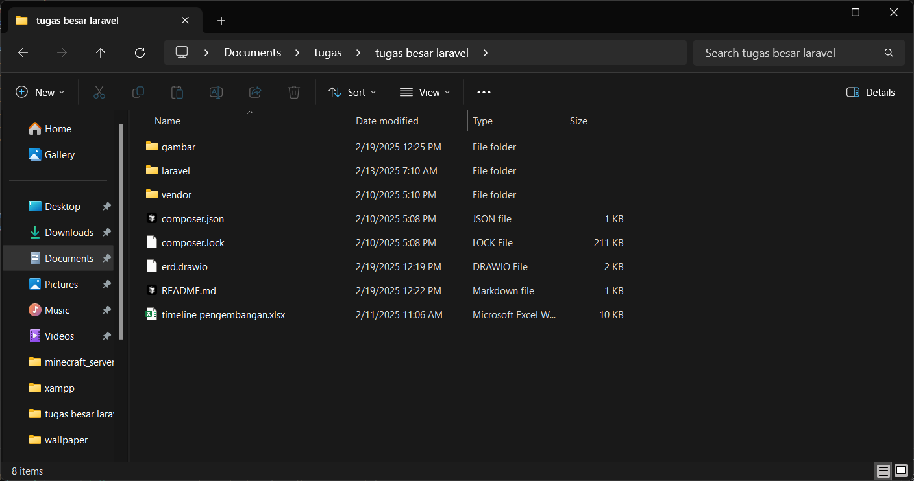
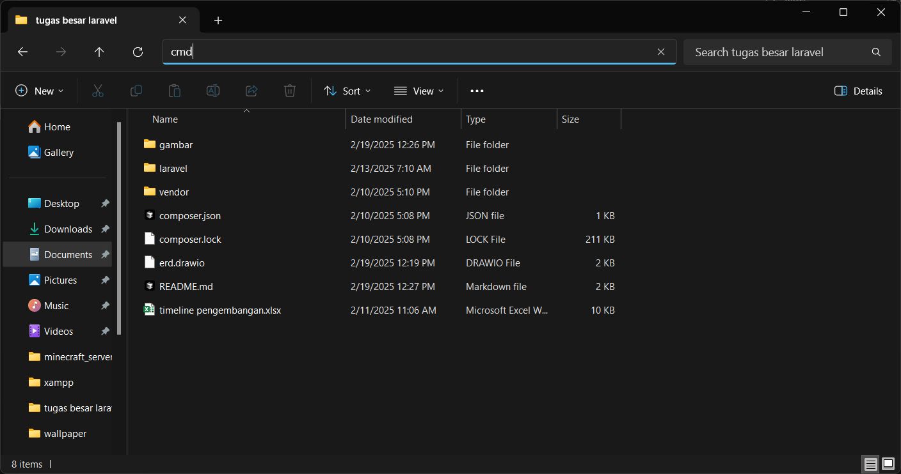
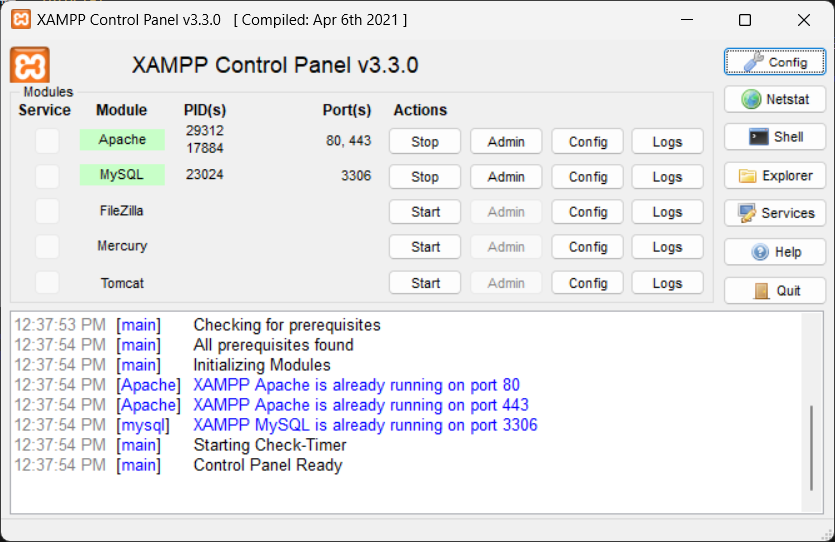
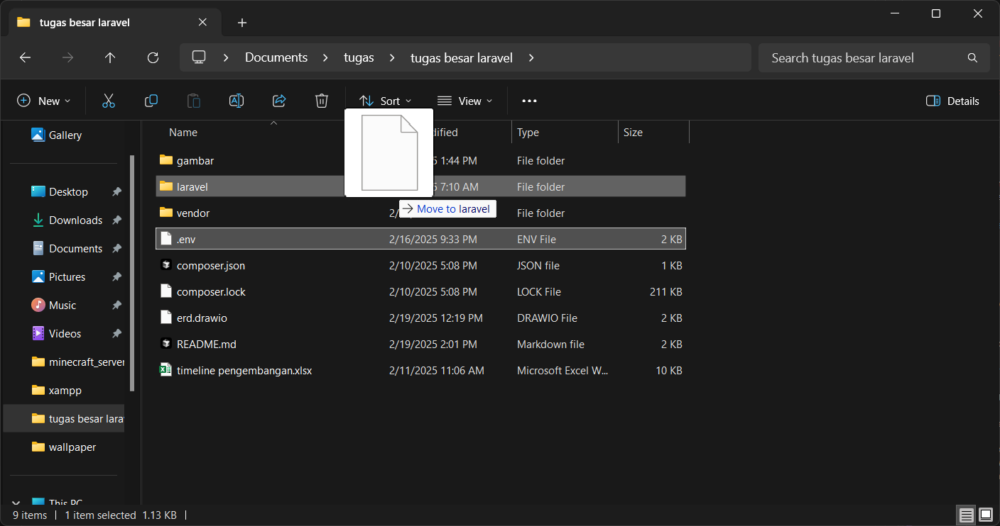

# 🌐 **Web App Lelang Online**

## **Link Laporan**  
(comment allowed)  
[Klik di sini untuk melihat laporan proyek](https://docs.google.com/document/d/1aLKvt86dR3p5bM2XWRmHSLlpqwGogH1KxHwkr3pRJCk/edit?usp=sharing)

---

## 🚀 **Tutorial**

1. **Install Node.js:** [Download Node.js](https://nodejs.org/dist/v22.14.0/node-v22.14.0-x64.msi)  
2. **Install XAMPP:** [Download XAMPP](https://sourceforge.net/projects/xampp/files/XAMPP%20Windows/8.0.30/xampp-windows-x64-8.0.30-0-VS16-installer.exe)  
3. **Install Composer:** [Download Composer](https://getcomposer.org/Composer-Setup.exe)  
4. **Install Project Ini:** [Download Project (ZIP)](https://github.com/ujangPNG/tugas-besar-laravel/archive/refs/heads/master.zip)  
5. **Setup Semua Aplikasi:** Jalankan installer dan ikuti instruksi (spam klik "Next" aja 😹)  

---

## 📂 **Persiapan Project**

1. **Ekstrak Project:** Ekstrak file zip project di lokasi yang kamu inginkan.  
2. **Buka Folder Project:** Arahkan ke folder project ini.  
3. **Buka CMD 3x di Direktori Project:** Klik kanan di folder project > pilih "Open in Terminal" atau gunakan cara cepat di bawah ini:  

  

  
<i style="font-size:10px;">cara cepat membuka cmd</i>  

  

4. **Arahkan CMD ke Folder Laravel:**
```bash
cd ./laravel
```

---

## ⚙️ **Install Dependensi Project**

1. **Install Composer:**
```bash
composer install
```
Pastikan direktori sudah di `/laravel`

2. **Jalankan XAMPP:** Start **Apache** dan **MySQL**

  

3. **Pindahkan File `.env`:** Pindahkan `.env` dari folder awal ke dalam folder `laravel`



---

## 🔧 **Setup Database & Storage**

1. **Migrasi Database:**
```bash
php artisan migrate
```

2. **Buat Link Storage:**
```bash
php artisan storage:link
```
Untuk memastikan gambar dapat tersimpan dengan benar

---

## 🎨 **Setup Frontend & Server**

1. **Install & Jalankan NPM:**
```bash
npm install
npm run dev
```

2. **Jalankan Server Laravel:**
```bash
php artisan serve
```
Akses aplikasi di: [http://127.0.0.1:8000/](http://127.0.0.1:8000/)

---

## 📝 **Sebelum Memulai**
Silakan **register** terlebih dahulu, karena database ini lokal dan belum ada akun bawaan.

---

## 💡 **Footer sisaan**
```php
!= $auction->user_id
```
- Menghindari agar pemilik item tidak bisa menambahkan bid pada lelangnya sendiri.

---

🎉 **Selamat mencoba! Semoga proyekmu sukses!** 🚀

