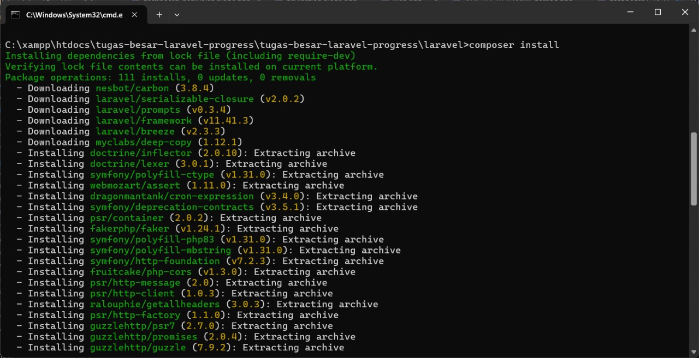

# **Web App Lelang Online**
## **link laporan**  
(comment allowed)
https://docs.google.com/document/d/1aLKvt86dR3p5bM2XWRmHSLlpqwGogH1KxHwkr3pRJCk/edit?usp=sharing  
  
## **Tutorial**  
  1. install <a href="https://nodejs.org/dist/v22.14.0/node-v22.14.0-x64.msi">nodejs</a>  
  2. install <a href="https://sourceforge.net/projects/xampp/files/XAMPP%20Windows/8.0.30/xampp-windows-x64-8.0.30-0-VS16-installer.exe">xampp</a>  
  3. install <a href="https://github.com/ujangPNG/tugas-besar-laravel/archive/refs/heads/master.zip/">project ini</a> (zip)  
  4. install <a href="https://getcomposer.org/Composer-Setup.exe">composer</a>
  6. setelah donlot semua, buka lalu setup. spam klik next aja
  7. extrak project ini di mana aja terserah, kemudian buka folder project ini. di bawah ini terkhusus buat yang ga ngerti cara pake terminal  
      
  8. buka cmd 3x di direktory project ini  
  <i style="font-size:10px;">cara cepat membuka cmd</i>  
      
  9. di semua cmd, ketik ```cd ./laravel```  
      
  10. ketik ```composer install``` di salah satu cmd (pastikan direktory sudah di /laravel)
      
  11. buka xampp, lalu start apache dan mysql  
      
  12. di cmd 1, ketik ```php artisan migrate``` untuk memasak database
  13. di cmd 2, ketik ```npm install``` lalu ```npm run dev``` untuk memasak javascript  
  14. di cmd 3, ketik ```php artisan serve``` untuk memulai server. server lokal bisa akses <a href="http://127.0.0.1:8000/">disini</a>.  
  
  
sebelum mulai, bisa register krn ini database lokal, jadi ga ada built in accountnya  
  
## Footer  
```!= $auction->user_id``` biar yg punya item ga bisa nambahin bid